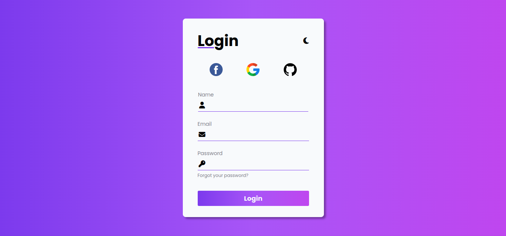
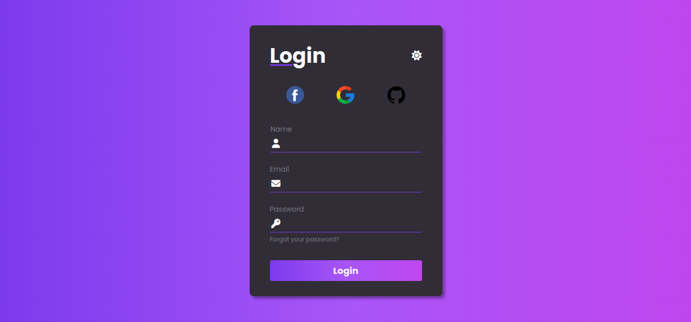

# Formulário de Login com Temas Dark e Light

Este projeto apresenta um formulário de login com a funcionalidade de alternar entre temas dark e light. Desenvolvido com HTML, CSS e JavaScript, oferece uma interface moderna e personalizável, permitindo ao usuário escolher o tema que melhor se adapta às suas preferências.

## Funcionalidades

- **Temas Dark e Light**: O formulário possui dois temas distintos, um escuro (dark) e outro claro (light), que podem ser alternados facilmente.
- **Alternância de Tema**: Um botão ou switch permite ao usuário trocar o tema do formulário de forma dinâmica.
- **Validação de Formulário**: Implementa validação básica dos campos de e-mail e senha, garantindo que o usuário insira informações válidas.

## Demonstração

## Como Usar

1. Clone o repositório para sua máquina local.
2. Abra o arquivo `index.html` em seu navegador.
3. Utilize o botão ou switch para alternar entre os temas dark e light.
4. Preencha os campos de e-mail e senha e clique em "Entrar".

## Personalização

Você pode personalizar o gerador editando o arquivo `style.css`. Altere as cores, fontes e outros estilos para criar sua própria aparência.

## Contribuições
Sinta-se à vontade para contribuir com melhorias, correções de bugs ou novas funcionalidades. Basta fazer um fork do repositório e enviar um pull request.